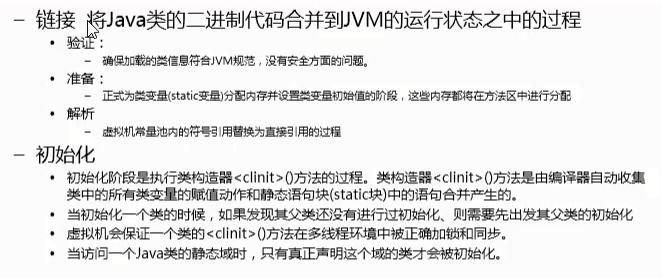
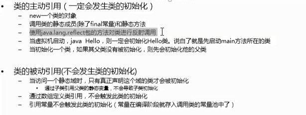
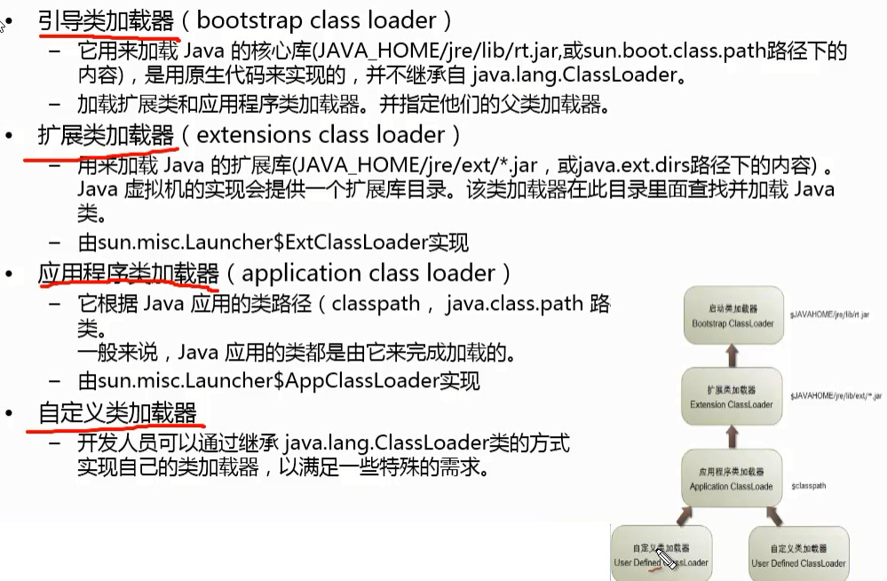
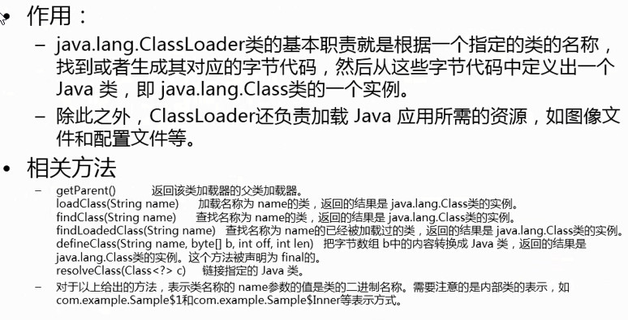
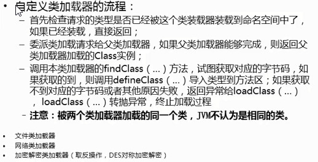
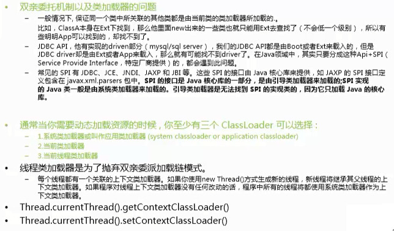
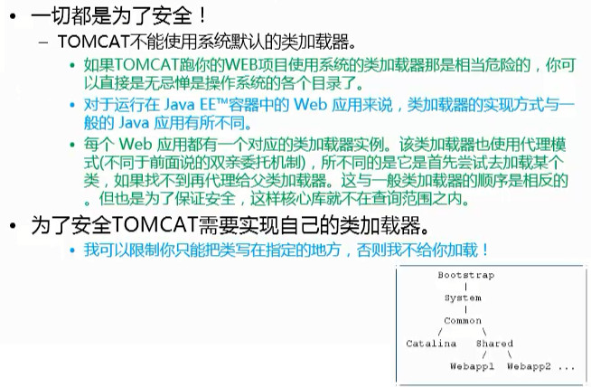
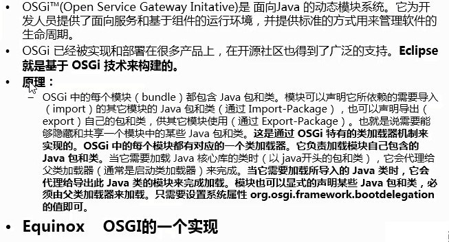

JVM核心之JVM运行和类加载全过程
==================

## 类加载全过程

深入了解java动态性，(解热部署、动态加载)，提高程序的灵活性

### 类加载器的层次结构(树状结构)

### java.class.ClassLoader 类介绍

## 自定义类加载器

----------------------------
线程上下文类加载器
============================

TOMCAT 服务器的类加载机制
============================

OSGI 原理介绍
=============
