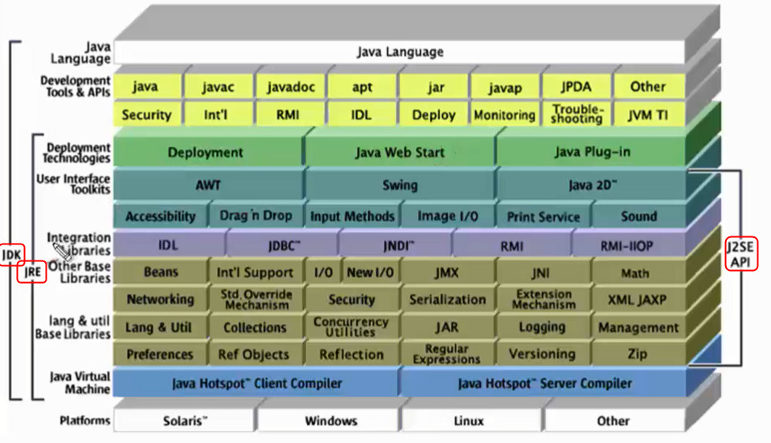
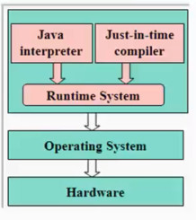
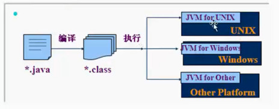
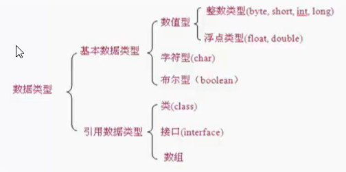

# java 环境基础

## JDK & JRE & JVM

- JDK

        Java Development kit java开发工具包
        
- JRE
    
        Java Runtime Environment java运行时环境

- JVM

        Java Virtual Machine java虚拟机

## 虚拟机 JVM

- jvm 是一种规范。就是一个虚拟的用于执行bytecodes字节码的计算机
- 可以使用软件来实现
- 可以使用硬件来实现

## JVM 和 java 跨平台特性

## 总结和提升

1、一个源文件可以有多个class

2、一个源文件中至多只能有一个public的类声明，其它类的个数不限，如果源文件中包含一个public的类源文件名必须和它中定义的public的类名相同，且以“java”为扩展名。

3、java是一种强类型语言，每个变量都必须声明其类型。

    - float 类型又被称作单精度类型，尾数可以精确到7位有效数字，在很多情况下，float类型的精度很难满足需求。
    - double 表示这种类型的数值精度是float类型的两倍，又称作为双精度，绝大部分应用程序都采用double类型。
    
4、局部变量和实例变量

    - 局部变量：方法或语句块内部定义的变量
        - 在使用前必须先声明和初始化（赋初值）
    - 实例变量(成员变量)：
        - 方法外部、类的内部定义的变量
        - 如果不自行初始化，他会自动初始化成该类型的默认初始值(数值型变量初始化成0或0.0，字符型变量的初始化值是16位的0，布尔型默认是false)
        
    
## 生成自己项目的API文档

- 特殊的注释：
    - 文档注释：/**
- 使用JAVADOC生成API文档
    - 解决问题：代码和文档的分离
- 常用的java注释标签
    - @Author 作者
    - @version 版本
    - @param 参数
    - @return 返回值的含义
    - @throws 抛出异常描述
    - @deprecated 废弃，建议用户不再使用该用户方法
