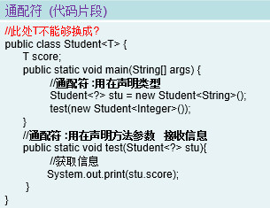

# 泛型 Generic

概念：泛型就是参数化类型

## 泛型入门 <>

1、泛型：标签，泛型类型

2、作用：省心 安全

## 六大方向

1、上下限

- 上限 extends : 指定的类型必须是继承某个类，或者实现某个接口(不是用implements)，即 <= 如

    - ? extends Fruit
    - T extends List
    
            不能添加信息
            存在以下规则，如
            - List<Fruit> 满足 List<? extends Fruit>
            - List<? extends Apple> 满足 List<? extends Fruit>
            - List<?> 等同 List<? extends Object>
            
             
               
- 下限 super ：指定的类型不能小于操作的类，即 >=

    - T super Apple
    - ? super Apple
    
            不能添加父对象
            存在以下规则，如
            - List<? super Fruit> 满足 List<? super Apple>
            - List<Fruit> 满足 List<? super Fruit>
            

            

2、泛型方法

3、泛型类

4、擦除

 擦除 --> 没有指定泛型的具体类型
 
    泛型的擦除：使用时|实现|继承 没有指定类型，类似于Object，但不等同于Object

5、接口

6、嵌套

## 自定义泛型

1、< >  --> 单个字母，尽可能见名知意

2、泛型类:声明时使用泛型

   T        Type
    
   K  V  Key  Value
   
   E  Element
    
3、注意点：泛型

    1、接口中 泛型字母只能使用在方法中，不能使用在全局常量中
    2、泛型只能使用引用类型，不能为基本类型
    3、泛型声明时字母不能使用在  静态属性|静态方法上
   
    
`//泛型声明时不能使用在 静态属性|静态方法上
    //private static T1 test;`
   
    
### 泛型类
  
    
### 泛型接口

注意：接口中泛型字母只能使用在方法中，不能使用在全局常量中

`public interface Comparam<T>{
    void compare(T t);
}`

### 泛型方法

## 泛型继承、实现

- 父类为泛型类，子类继承时：
    
    - 父类擦除|指定类型，子类按需编写
    - 父类存在泛型，子类必须 >= (个数比父类多)
    - 属性及方法类型：随位置而定

- 接口为泛型接口

    - 与继承同理，重写方法随接口而定
    
## 总结
1、继承|实现

- 1)、保留 -- 泛型子类
- 2)、不保留 -- 按需实现 可以泛型子类，也可以是非泛型子类

2、属性|方法 --随声明位置指定

擦出：使用|继承|实现 没有指定类型，类似于Object

## 通配符

- T 、 K、 V、 E 等泛型字母为  有类型，类型参数赋予具体的值
- ? 未知类型  类型参数赋予不确定值，任意类型
- 只能用在声明类型 、方法参数上，不能用在定义泛型类上

