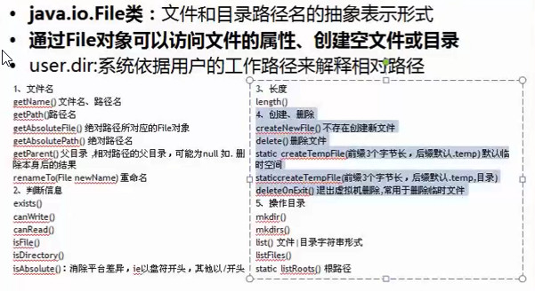
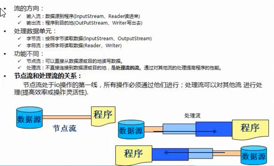
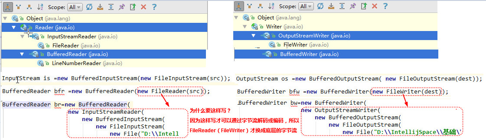
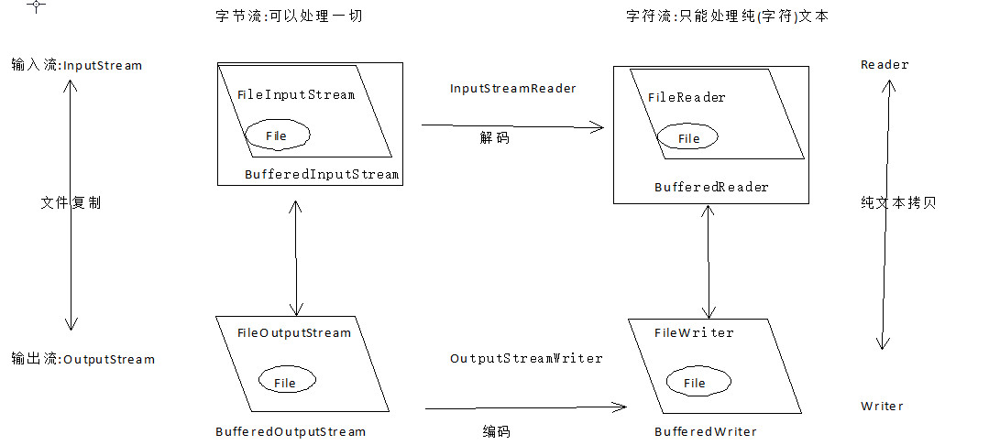

# IO 流

## File类

## 流的原理

**流：** 流动、流向 从一端移动到另一端 源头与目的地

**程序** 与 文件|数组|网络连接|数据库，以程序为中心

## IO流分类

1、流向：输入流与输出流

2、数据：
    
 - 字节流：二进制，可以处理一切文件 包括  纯文本、doc、音频、视频等等
 - 字符流：文本文件，只能处理纯文本
 
3、功能：

 - 节点流：包裹源头
 - 处理流：增强功能，提供性能，节点流之上
 

 
## 字节流与字符流（重点）与文件

1、字节流(可以处理一切东西，包括二进制文件、音频、视频、doc等等)

 - 输入流
  - InputStream   FileInputStream
  
 - 输出流
  - OutputStream  FileOutputStream

2、字符流(只能处理纯文本，全部为可见字符流 .txt文件 .html文件等等)

 - 输入流
   
    - Reader FileReader
  
 - 输出流
   
    - Writer FileWriter
  
 
## 处理流

### 缓冲流

 1)、字节缓冲流
   
   - BufferedInputStream
   - BufferedOutPutStream
    
 2)、字符缓冲流
 
   - BufferedReader
   - BufferedWriter
   
### 转换流：字节流 转为字节流 处理乱码（编码集、解码集）

1、编码与解码概念

编码：字符 --编码字符集 >= 二进制

解码：二进制 --解码字符集--> 字符

## 总结

