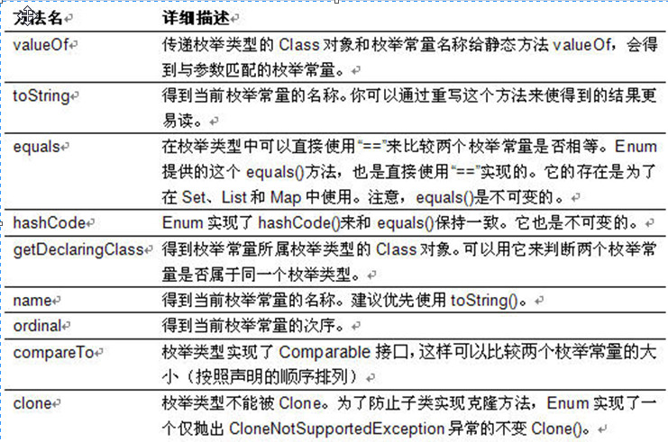

# 枚举

- 定义

- 自实现枚举类

- 使用enum定义枚举类

- 实现接口的枚举类

- 枚举类的方法

## 概述

    应用场景：在某些情况下，一个类的对象是有限而且固定的。例如季节类，只能有4个对象

为什么要使用枚举？

    在JDK1.5之前，定义常量：
        public static final ...
    枚举，可以把相关的常量分组到一个枚举类型里，而且枚举提供了比常量更多的方法：
    
    在JDK1.6之前的switch语句只支持int，char，enum类型,使用枚举，能让我们的代码可读性更强
    
    
    
什么场景使用枚举?

    1、用法1：常量
       public enum Color{
            RED,GREEN,BLANK,YELLOW
       }
       
    2、用法2：switch
    3、用法3：像枚举中添加新方法
    4、用法4：覆盖枚举的方法
    5、用法5：实现接口
    6、用法6：实现接口组织枚举
    7、用法7：关于枚举集合的使用
   
### 枚举类的方法
