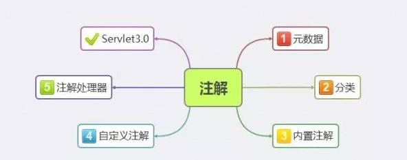

# 注解

概述：

注解是Java 1.5引入的，目前已被广泛应用于各种Java框架，如Hibernate，Jersey，
Spring。注解相当于是一种嵌入在程序中的元数据，可以使用注解解析工具或编译器对
其进行解析，也可以指定注解在编译期或运行期有效。
 



**java注解有以下几个知识点：**
- 元数据(metadata)
- 注解[Annotation(注解)]的分类
- 内置注解
- 自定义注解
- 注解处理器
- Servlet3.0

## 注解分类

### 根据注解参数的个数:

1)、标记注解:一个没有成员定义的Annotation类型被称为标记注解。

2)、单值注解:只有一个值

3)、完整注解:拥有多个值

### 根据注解使用方法和用途:

1)、JDK内置系统注解

2)、元注解

3)、自定义注解

##  内置注解

JavaSE中内置三个标准注解，定义在java.lang中：`@Override`-- 重写、`@Deprecated`-- 废弃、`@SuppressWarnings`--抑制告警

## 自定义告警

`@interface` 声明一个注解

元注解：元注解的作用就是负责注解其他注解 

`@Target`: 用于描述注解的使用范围（即：被描述的注解可以用在什么地方）

  表示支持注解的程序元素的种类，一些可能的值有TYPE, METHOD, CONSTRUCTOR, FIELD等等。如果Target元注解不存在，那么该注解就可以使用在任何程序元素之上。

```$xslt
取值(ElementType)有：

1.CONSTRUCTOR:用于描述构造器

2.FIELD:用于描述域

3.LOCAL_VARIABLE:用于描述局部变量

4.METHOD:用于描述方法

5.PACKAGE:用于描述包

6.PARAMETER:用于描述参数

7.TYPE:用于描述类、接口(包括注解类型) 或enum声明

//此注解只能用在方法上
@Target(ElementType.METHOD) 
@interface TestMethod {}
```

`@Retention`: 表示需要在什么级别保存该注释信息，用于描述注解的生命周期（
即：被描述的注解在什么范围内有效）表示注解类型保留时间的长短。

```$xslt
取值(RetentionPoicy)有：

1.SOURCE:在源文件中有效（即源文件保留）

2.CLASS:在class文件中有效（即class保留）

3.RUNTIME:在运行时有效（即运行时保留）

// 此注解可以用于注解类、接口(包括注解类型) 或enum声明
@Target(ElementType.TYPE) 
//该注解运行时有效。注解处理器可以通过反射，获取到该注解的属性值，从而去做一些运行时的逻辑处理
@Retention(RetentionPolicy.RUNTIME)
@interface TestRn{
}
```

`@Documented`: 表示使用该注解的元素应被javadoc或类似工具文档化，它应用于类型声明，
类型声明的注解会影响客户端对注解元素的使用。如果一个类型声明添加了Documented注解，
那么它的注解会成为被注解元素的公共API的一部分，@Documented是一个标记注解。

```java
//可以被例如javadoc此类的工具文档化
@Documented
@interface TestDoc{	
}
```

`@Inherited`表示一个注解类型会被自动继承，如果用户在类声明的时候查询注解类型，同时
类声明中也没有这个类型的注解，那么注解类型会自动查询该类的父类，这个过程将会不停地重
复，直到该类型的注解被找到为止，或是到达类结构的顶层（Object）。

```java
//被子类继承的注解
@Inherited
@interface TestInheri{}
```

## 你真的了解注解吗?

**使用@interface自定义注解时，自动继承了`java.lang.annotation.Annotation`接口，由编译程序自动完成其他细节。在定义注解时，不能继承其他的注解或接口。**

- ⑴定义注解格式：

`@interface`用来声明一个注解，其中的每一个方法实际上是声明了一个配置参数。方法的名称就是参数的名称，
返回值类型就是参数的类型（**返回值类型只能是基本类型、Class、String、enum**）。可以通过default来声明参数的默认值。

`public @interface 注解名{定义体s}`

- ⑵注解参数(即方法)

  注解里面的每一个方法实际上就是声明了一个配置参数，其规则如下:

  - ①修饰符
     
     只能用public或默认(default)这两个访问权修饰 ，默认为default
     
  - ②类型
    
   注解参数只支持以下数据类型：
   
    - 基本数据类型（int,float,boolean,byte,double,char,long,short)；
    - String类型；
    - Class类型；
    - enum类型；
    - Annotation类型;

   以上所有类型的数组

  - ③命名

   对取名没有要求，如果只有一个参数成员,最好把参数名称设为"value",后加小括号。

  - ④参数

   注解中的方法不能存在参数

  - ⑤默认值

   可以包含默认值，使用default来声明默认值。

- ⑶实例如下

```java
/*
 * 码农定义注解
 */
@Target(ElementType.FIELD)
@Retention(RetentionPolicy.RUNTIME)
@Documented
@interface Programmer{
	String value() default "马云";
}
/**
 * 码农类型注解
 * @author peida
 */
@Target(ElementType.FIELD)
@Retention(RetentionPolicy.RUNTIME)
@Documented
@interface ProgrammerType {
 /**
 * 类型枚举 程序猿 射鸡师
 */
 public enum CoderType{MONKEYS,LION,CHOOK};
 /**
 * 颜色属性
 */
 CoderType type() default CoderType.MONKEYS;
}
/**
 * 码农制造厂
 * @author Administrator
 */
@Target(ElementType.FIELD)
@Retention(RetentionPolicy.RUNTIME)
@Documented
@interface ProgrammerProductor {
 /**
 * 厂家编号
 * @return
 */
 public int id() default -1;
 /**
 * 厂家名称
 * @return
 */
 public String name() default "shsxt"; 
 /**
 * 厂家地址
 * @return
 */
 public String address() default "上海";
}
/**
 * 注解使用
*/
class Coder{
		@Programmer("老裴")
	 private String coderName;
		@ProgrammerType(type=CoderType.MONKEYS)
	 private String coderType;
		@ProgrammerProductor(id=1,name="程序猿乐园",address="荣乐东路")
	 private String coderProductor;
		public String getCoderName() {
			return coderName;
		}
		public void setCoderName(String coderName) {
			this.coderName = coderName;
		}
		public String getCoderType() {
			return coderType;
		}
		public void setCoderType(String coderType) {
			this.coderType = coderType;
		}
		public String getCoderProductor() {
			return coderProductor;
		}
		public void setCoderProductor(String coderProductor) {
			this.coderProductor = coderProductor;
		}	
}
```
