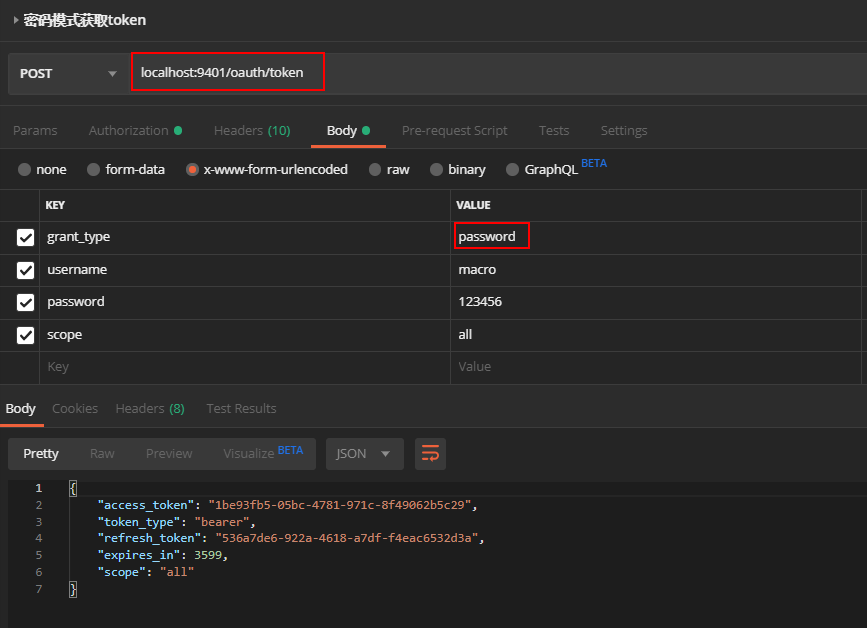
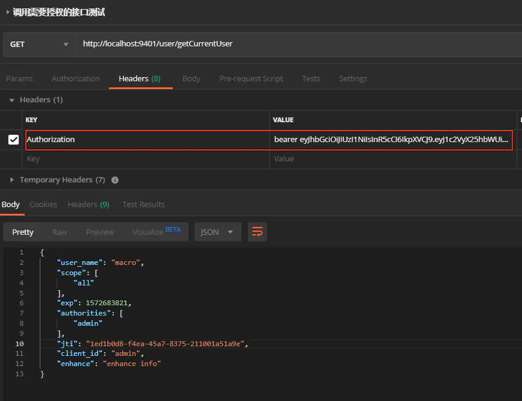

## 使用redis存储token

1、运行项目后使用密码模式来获取令牌，访问如下地址：http://localhost:9401/oauth/token



2、进行获取令牌操作，可以发现令牌已经被存储到Redis中。


## 使用JWT存储token

1、运行项目后使用密码模式来获取令牌，访问如下地址：http://localhost:9401/oauth/token


2、发现获取到的令牌已经变成了JWT令牌，将access_token拿到https://jwt.io/ 网站上去解析下可以获得其中内容。
```json
{
  "exp": 1572682831,
  "user_name": "macro",
  "authorities": [
    "admin"
  ],
  "jti": "c1a0645a-28b5-4468-b4c7-9623131853af",
  "client_id": "admin",
  "scope": [
    "all"
  ]
}
```

3、将令牌放入Authorization头中，访问如下地址获取信息：http://localhost:9401/user/getCurrentUser




