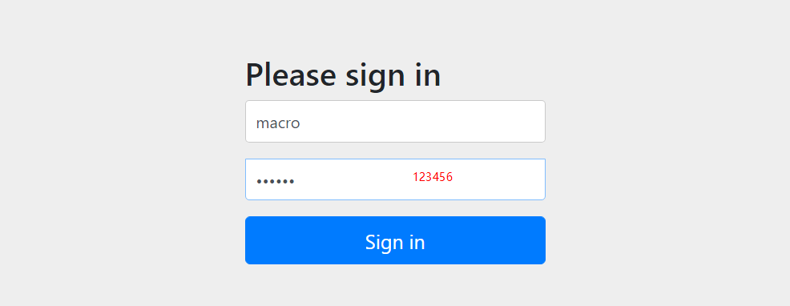
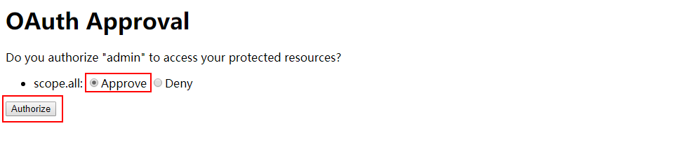
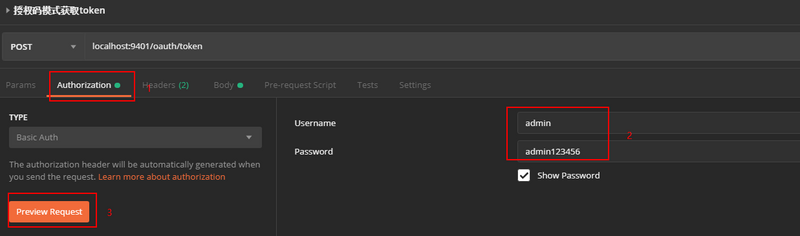
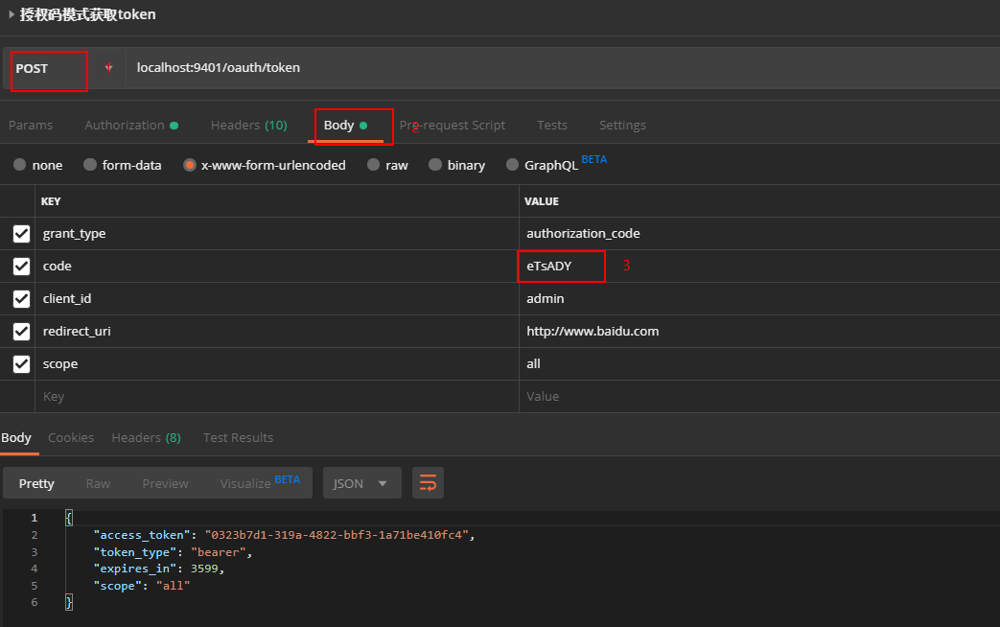
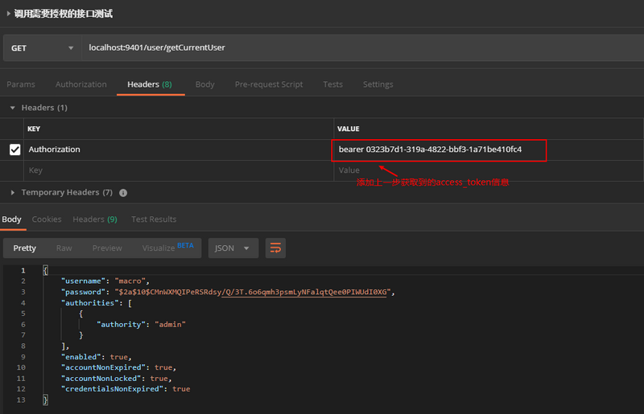
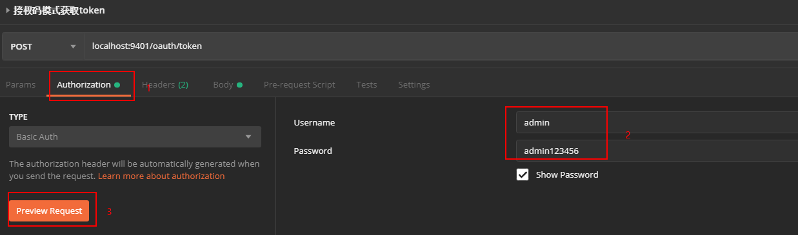
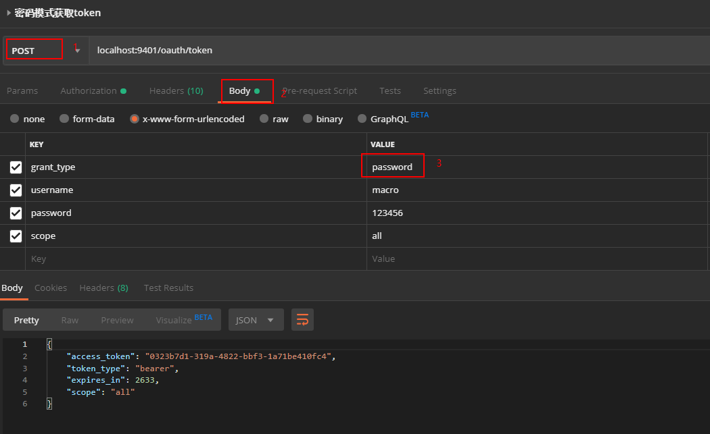

## 授权码模式使用

1、启动oauth2-server服务；

2、在浏览器访问该地址进行登录授权：http://localhost:9401/oauth/authorize?response_type=code&client_id=admin&redirect_uri=http://www.baidu.com&scope=al...

3、输入账号密码进行登录操作：



4、登录后进行授权操作：
 
 

5、之后会浏览器会带着授权码跳转到我们指定的路径：
```
https://www.baidu.com/?code=eTsADY&state=normal
```

6、使用授权码请求该地址获取访问令牌：http://localhost:9401/oauth/token

7、使用Basic认证通过client_id和client_secret构造一个Authorization头信息；
  
 

在body中添加以下参数信息，通过POST请求获取访问令牌；

 

8、在请求头中添加访问令牌，访问需要登录认证的接口进行测试，发现已经可以成功访问：http://localhost:9401/user/getCurrentUser

 


## 密码模式使用

1、使用密码请求该地址获取访问令牌：http://localhost:9401/oauth/token

2、使用Basic认证通过client_id和client_secret构造一个Authorization头信息；

 

3、在body中添加以下参数信息，通过POST请求获取访问令牌；

 