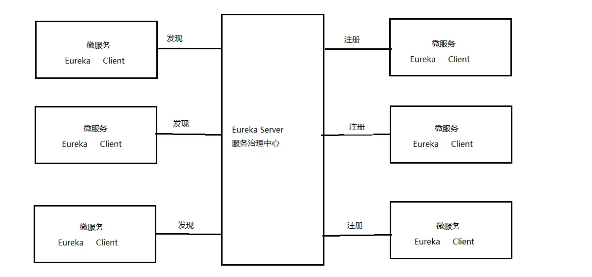
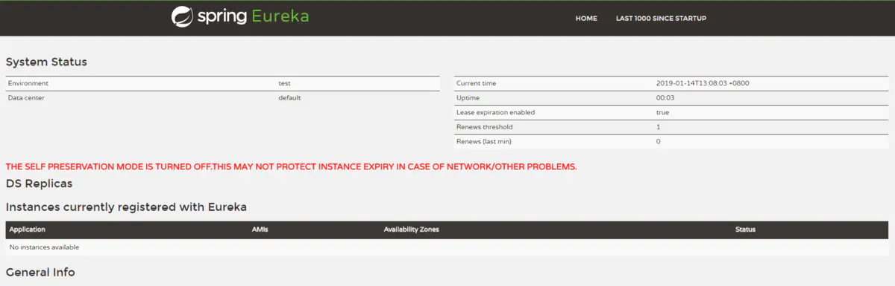
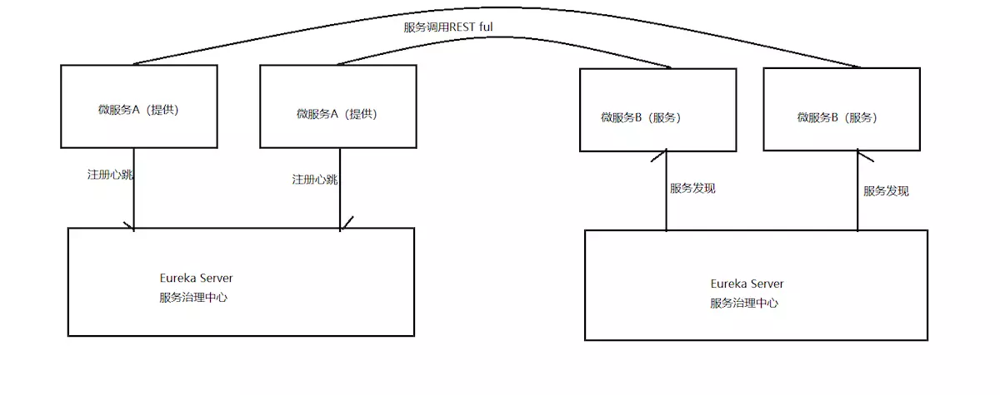

# 知识点

## 1、eureka

**为什么 要用注册中心？**

1、微服务数量众多，要进行远程调用就需要知道服务端的ip地址和端口，注册中心帮助我们管理这些服务的ip和端口。

2、微服务会实时上报自己的状态，注册中心统一管理这些微服务的状态，将存在问题的服务踢出服务列表，客户端获取到可用的服务进行调用。



- 1、Eureka Server是服务端，负责管理各各微服务结点的信息和状态。
- 2、在微服务上部署Eureka Client程序，远程访问Eureka Server将自己注册在Eureka Server。
- 3、微服务需要调用另一个微服务时从Eureka Server中获取服务调用地址，进行远程调用。

**使用方式**
* 步骤一： 在在父工程添加依赖
```xml
            <dependency>
                <groupId>org.springframework.cloud</groupId>
                <artifactId>spring-cloud-dependencies</artifactId>
                <version>Finchley.SR1</version>
                <type>pom</type>
                <scope>import</scope>
            </dependency>
```
* 步骤二： 在Eureka Server工程添加:
```xml
    <dependencies>
        <!-- 导入Eureka服务的依赖 -->
        <dependency>
            <groupId>org.springframework.cloud</groupId>
            <artifactId>spring-cloud-starter-netflix-eureka-server</artifactId>
        </dependency>
    </dependencies>
```
* 步骤三：编写启动类( @EnableEurekaServer标识此服务为Eureka服务）和 配置
```java
// @EnableEurekaServer 需要在启动类上用
// @EnableEurekaServer标识此服务为Eureka服务
@EnableEurekaServer//标识这是一个Eureka服务
@SpringBootApplication
public class GovernCenterApplication {
    public static void main(String[] args) {
        SpringApplication.run(GovernCenterApplication.class, args);
    }
}
```
application.yml的配置内容如下：
```yaml
server:
  port: 50101 #服务端口

spring:
  application:
    name: xc‐govern‐center #指定服务名
eureka:
  client:
    registerWithEureka: false #服务注册，是否将自己注册到Eureka服务中
    fetchRegistry: false #服务发现，是否从Eureka中获取注册信息
    serviceUrl: #Eureka客户端与Eureka服务端的交互地址，高可用状态配置对方的地址，单机状态配置自己（如果不配置则默认本机8761端口）
      defaultZone: http://localhost:50101/eureka/
  server:
    enable‐self‐preservation: false #是否开启自我保护模式
    eviction‐interval‐timer‐in‐ms: 60000 #服务注册表清理间隔（单位毫秒，默认是60*1000)
```
registerWithEureka：被其它服务调用时需向Eureka注册
fetchRegistry：需要从Eureka中查找要调用的目标服务时需要设置为true
serviceUrl.defaultZone 配置上报Eureka服务地址高可用状态配置对方的地址，单机状态配置自己
enable-self-preservation：自保护设置，下边有介绍。
eviction-interval-timer-in-ms：清理失效结点的间隔，在这个时间段内如果没有收到该结点的上报则将结点从服务列表中剔除。

* 步骤四： 启动Eureka Server，浏览50101端口。



上图红色提示信息：
THE SELF PRESERVATION MODE IS TURNED OFF.THIS MAY NOT PROTECT INSTANCE EXPIRY IN CASE OFNETWORK/OTHER PROBLEMS.

自我保护模式被关闭。在网络或其他问题的情况下可能不会保护实例失效。

Eureka Server有一种自我保护模式，当微服务不再向Eureka Server上报状态，Eureka Server会从服务列表将此服务
删除，如果出现网络异常情况（微服务正常），此时Eureka server进入自保护模式，不再将微服务从服务列表删除。
在开发阶段建议关闭自保护模式

## 2、高可用
Eureka Server 高可用环境需要部署两个Eureka server，它们互相向对方注册。如果在本机启动两个Eureka需
要注意两个Eureka Server的端口要设置不一样，这里我们部署一个Eureka Server工程，将端口可配置，制作两
个Eureka Server启动脚本，启动不同的端口，如下图：


1、在实际使用时Eureka Server至少部署两台服务器，实现高可用。
2、两台Eureka Server互相注册。
3、微服务需要连接两台Eureka Server注册，当其中一台Eureka死掉也不会影响服务的注册与发现。
4、微服务会定时向Eureka server发送心跳，报告自己的状态。
5、微服务从注册中心获取服务地址以RESTful方式发起远程调用

配置如下：
```yaml
##1、端口可配置
server:
  port: ${PORT:50101} #服务端口

##2、Eureka服务端的交互地址可配置
eureka:
  client:
    registerWithEureka: true #服务注册，是否将自己注册到Eureka服务中
    fetchRegistry: true #服务发现，是否从Eureka中获取注册信息
    serviceUrl: #Eureka客户端与Eureka服务端的交互地址，高可用状态配置对方的地址，单机状态配置自己（如果不配置则默认本机8761端口）
      defaultZone: ${EUREKA_SERVER:http://eureka02:50102/eureka/}
```
配置hostname：

Eureka 组成高可用，两个Eureka互相向对方注册，这里需要通过域名或主机名访问，这里我们设置两个Eureka服务的主机
名分别为 eureka01、eureka02。
完整的eureka配置如下：

```yaml
eureka:
  client:
    registerWithEureka: true #服务注册，是否将自己注册到Eureka服务中
    fetchRegistry: true #服务发现，是否从Eureka中获取注册信息
    serviceUrl: #Eureka客户端与Eureka服务端的交互地址，高可用状态配置对方的地址，单机状态配置自己（如果不配置则默认本机8761端口）
      defaultZone: ${EUREKA_SERVER:http://eureka02:50102/eureka/}
  server:
    enable‐self‐preservation: false #是否开启自我保护模式
    eviction‐interval‐timer‐in‐ms: 60000 #服务注册表清理间隔（单位毫秒，默认是60*1000)
  instance:
    hostname: ${EUREKA_DOMAIN:eureka01}
```

## 3、在IDEA中制作启动脚本

`-DPORT=50101 -DEUREKA_SERVER=http://eureka02:50102/eureka/ -DEUREKA_DOHAIN=eureka01`


## 服务注册

**使用方式：**
* 步骤一： 在服务中添加依赖 和 配置
```xml
        <dependency>
            <groupId>org.springframework.cloud</groupId>
            <artifactId>spring-cloud-starter-netflix-eureka-client</artifactId>
        </dependency>
```
在application.yml配置
```yaml
eureka:
  client:
    registerWithEureka: true #服务注册开关
    fetchRegistry: true #服务发现开关
    serviceUrl: #Eureka客户端与Eureka服务端进行交互的地址，多个中间用逗号分隔
      defaultZone: ${EUREKA_SERVER:http://localhost:50101/eureka/,http://localhost:50102/eureka/}
  instance:
    prefer-ip-address:  true  #将自己的ip地址注册到Eureka服务中
    ip-address: ${IP_ADDRESS:127.0.0.1}
    instance-id: ${spring.application.name}:${server.port} #指定实例id
```

* 步骤二： 在启动类上添加注解
`在启动类上添加注解 @EnableDiscoveryClient ，表示它是一个Eureka的客户端`
